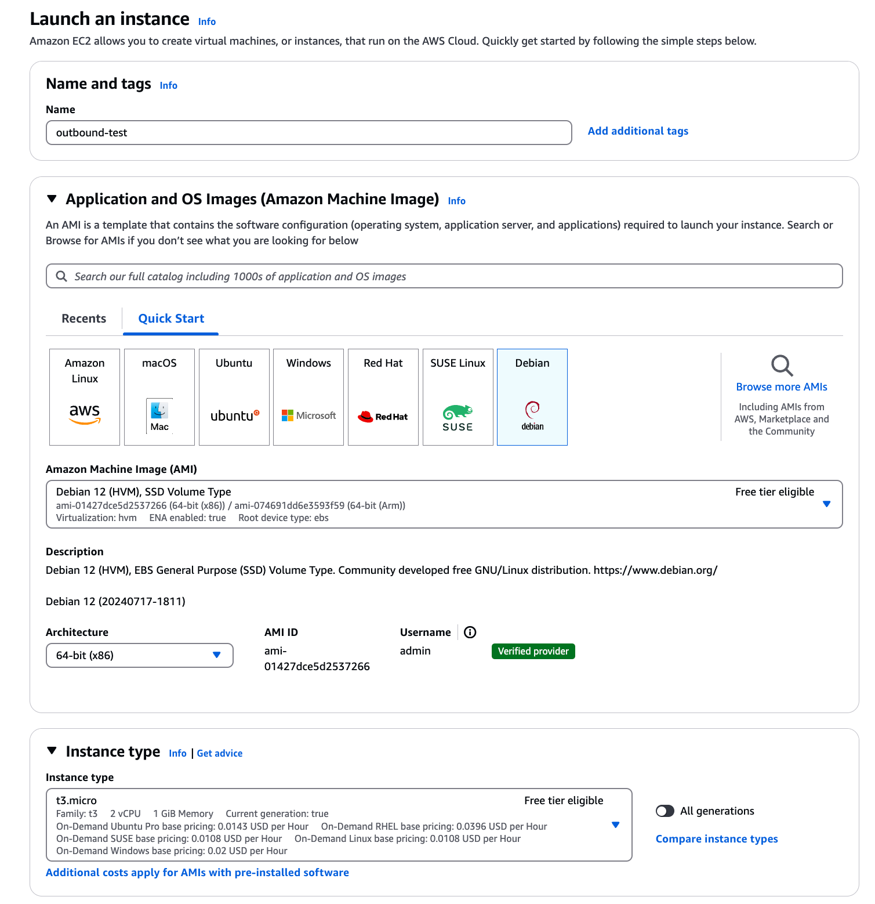
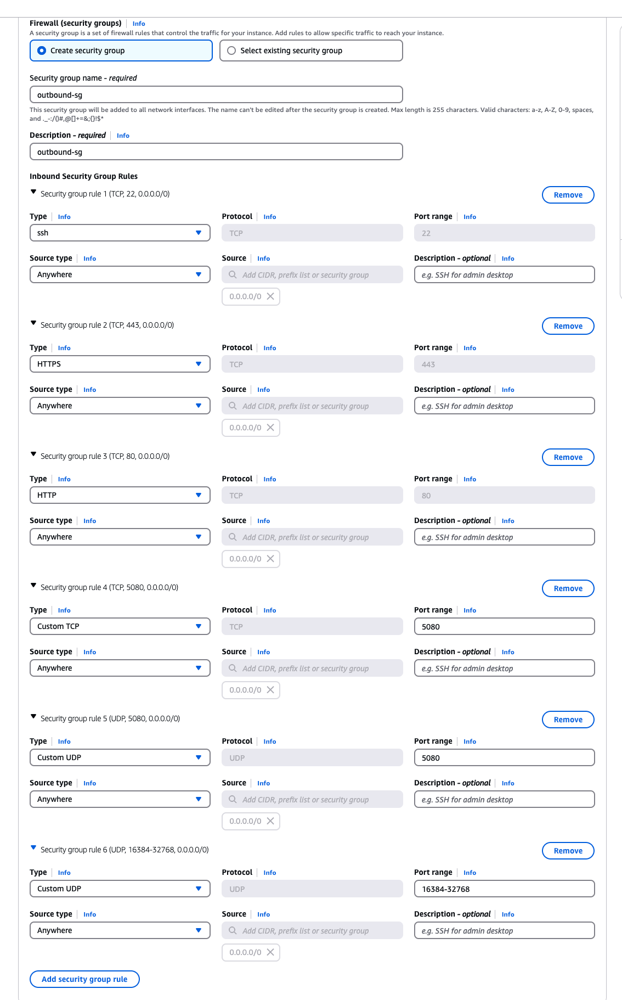
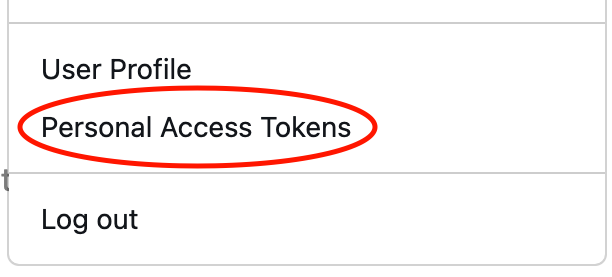
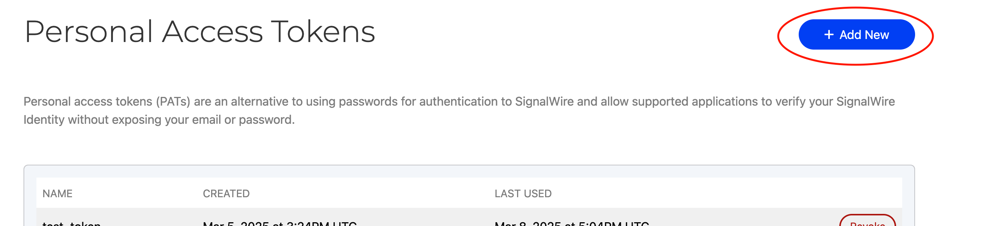
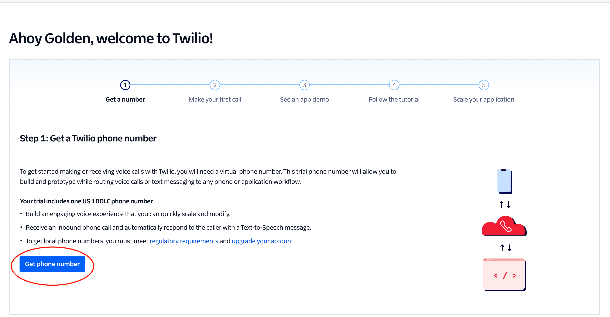
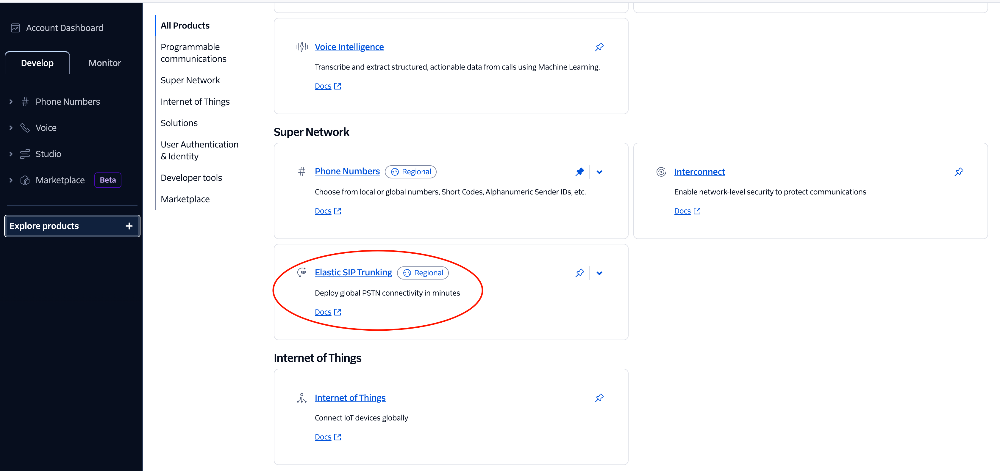
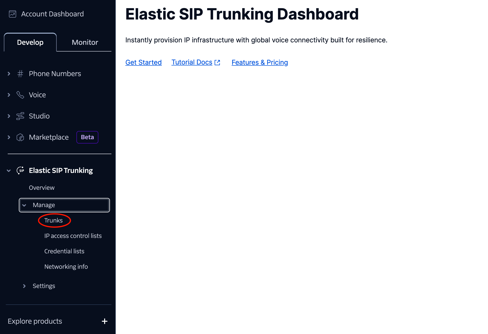
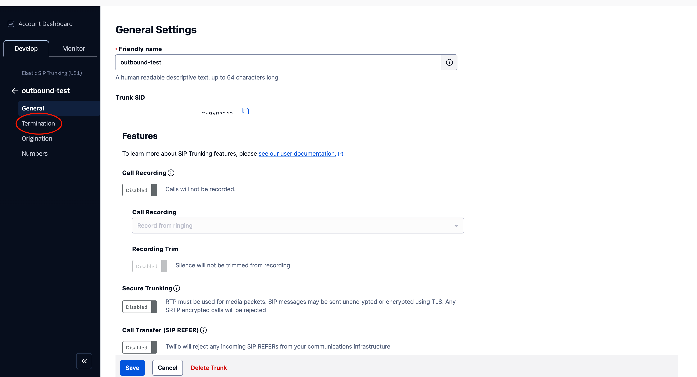
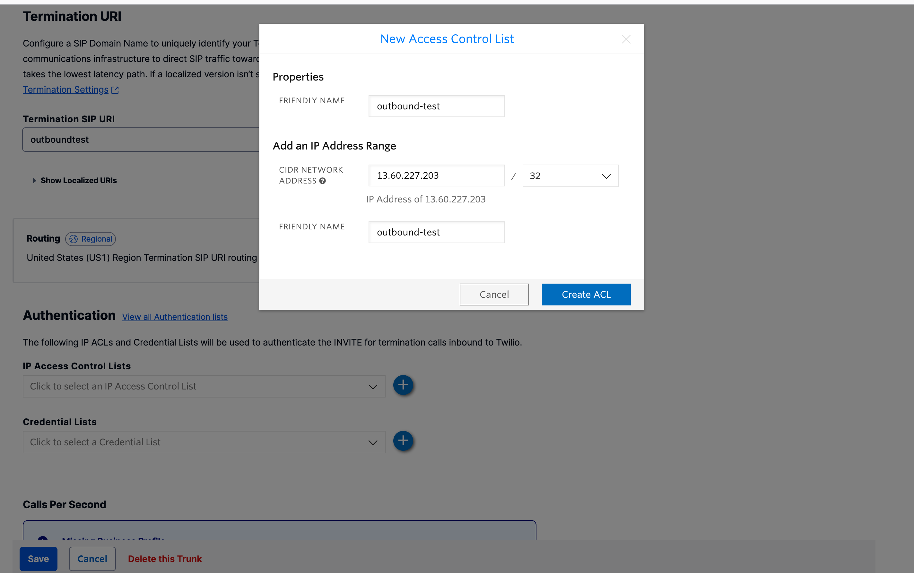
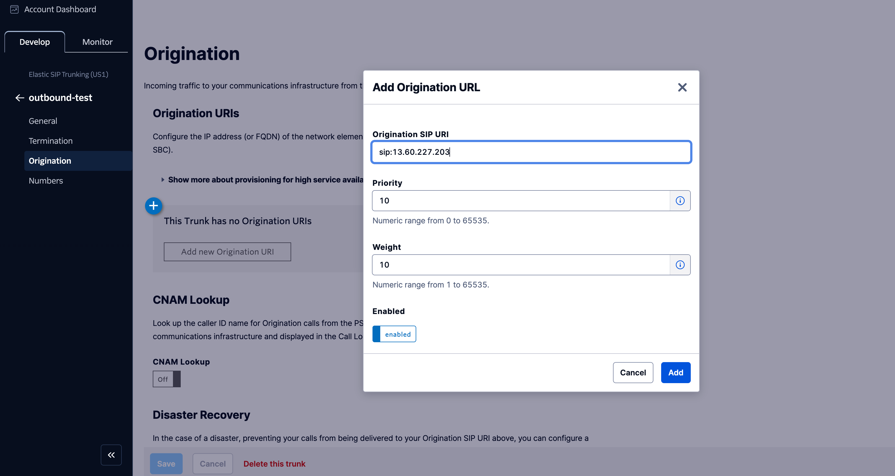

# Setting Up FreeSWITCH with Twilio SIP Trunking on AWS

This comprehensive guide will walk you through setting up FreeSWITCH on an AWS EC2 Debian instance and integrating it with Twilio for outbound calling capabilities.

## Table of Contents

1. [AWS EC2 Setup](#aws-ec2-setup)
2. [FreeSWITCH Installation](#freeswitch-installation)
3. [FreeSWITCH Configuration](#freeswitch-configuration)
4. [Twilio SIP Trunk Setup](#twilio-sip-trunk-setup)
5. [Integration Testing](#integration-testing)

## AWS EC2 Setup

### Provision a Debian Instance

- Launch a Debian EC2 instance with at least 1GB RAM (t2.micro or larger)

- Configure Security Group with the following ports:
    - SSH (22) - TCP
    - SIP (5080) - TCP and UDP
    - RTP Media (16384-32768) - UDP
    

### Configure Security Group

```bash
# From AWS Console:
# EC2 Dashboard > Network Settings > Security Groups > Edit inbound rules > Add rule
# Rule 1: Custom TCP, Port 5080, Source 0.0.0.0/0
# Rule 2: Custom UDP, Port 5080, Source 0.0.0.0/0
# Rule 3: Custom UDP, Port Range 16384-32768, Source 0.0.0.0/0
```


### Connect to Your Instance
```bash
# Create your SSH key pair file and paste in the private key used in provisioning your instance.
sudo nano ~/.ssh/key.pem

# Set your SSH key to not publicly viewable
chmod 400 ~/.ssh/your-key.pem

# Start SSH agent and add your key
eval "$(ssh-agent -s)"
ssh-add ~/.ssh/your-key.pem

# Connect to your instance
ssh -i "~/.ssh/your-key.pem" admin@your-ec2-public-dns
```

## FreeSWITCH Installation

### Update System and Install Dependencies

```bash
# Update system packages
sudo apt update && sudo apt upgrade -y

# Install dependencies
sudo apt install -yq git curl wget build-essential pkg-config libssl-dev \
  protobuf-compiler python3 python3-pip unzip python3-venv swig \
  postgresql postgresql-contrib redis-server gnupg2 lsb-release
```

### Add SignalWire Repository

```bash
# Get a SignalWire token from https://signalwire.com
TOKEN=YOURSIGNALWIRETOKEN  # Replace with your actual token

# Download repository key
sudo wget --http-user=signalwire --http-password=$TOKEN \
  -O /usr/share/keyrings/signalwire-freeswitch-repo.gpg \
  https://freeswitch.signalwire.com/repo/deb/debian-release/signalwire-freeswitch-repo.gpg

# Configure authentication
echo "machine freeswitch.signalwire.com login signalwire password $TOKEN" | sudo tee /etc/apt/auth.conf
sudo chmod 600 /etc/apt/auth.conf

# Add repository sources
echo "deb [signed-by=/usr/share/keyrings/signalwire-freeswitch-repo.gpg] \
  https://freeswitch.signalwire.com/repo/deb/debian-release/ `lsb_release -sc` main" | \
  sudo tee /etc/apt/sources.list.d/freeswitch.list

echo "deb-src [signed-by=/usr/share/keyrings/signalwire-freeswitch-repo.gpg] \
  https://freeswitch.signalwire.com/repo/deb/debian-release/ `lsb_release -sc` main" | \
  sudo tee -a /etc/apt/sources.list.d/freeswitch.list

# Update package lists
sudo apt update
```
- `YOURSIGNALWIRETOKEN` can be created/retrieved from the signalwire dashboard under "personal access tokens".
 

### Install FreeSWITCH from Source

```bash
# Install build dependencies
sudo apt -y build-dep freeswitch

# Clone the repository
cd /usr/src
sudo git clone https://github.com/signalwire/freeswitch.git -bv1.10 freeswitch
cd freeswitch
sudo chown -R admin:admin /usr/src/freeswitch

# Configure and build
git config pull.rebase true
./bootstrap.sh -j
./configure
make
sudo make install

# Install sound files
sudo make cd-sounds-install cd-moh-install
```

### Set Owner and Permissions

```bash
cd /usr/local
sudo groupadd freeswitch
sudo adduser --quiet --system --home /usr/local/freeswitch --gecos "FreeSWITCH open source softswitch" \
  --ingroup freeswitch freeswitch --disabled-password
sudo chown -R freeswitch:freeswitch /usr/local/freeswitch/
sudo chmod -R ug=rwX,o= /usr/local/freeswitch/
sudo chmod -R u=rwx,g=rx /usr/local/freeswitch/bin
```

### Configure systemd Service

```bash
# Create service file
sudo tee /etc/systemd/system/freeswitch.service > /dev/null << 'EOF'
[Unit]
Description=FreeSWITCH
After=syslog.target network.target local-fs.target

[Service]
Type=forking
PIDFile=/usr/local/freeswitch/run/freeswitch.pid
PermissionsStartOnly=true
ExecStartPre=/bin/mkdir -p /usr/local/freeswitch/run
ExecStartPre=/bin/chown freeswitch:daemon /usr/local/freeswitch/run
ExecStart=/usr/local/freeswitch/bin/freeswitch -ncwait -nonat
TimeoutSec=45s
Restart=always
WorkingDirectory=/usr/local/freeswitch/run
User=freeswitch
Group=daemon
LimitCORE=infinity
LimitNOFILE=100000
LimitNPROC=60000
LimitRTPRIO=infinity
LimitRTTIME=7000000
IOSchedulingClass=realtime
IOSchedulingPriority=2
CPUSchedulingPolicy=rr
CPUSchedulingPriority=89
UMask=0007

[Install]
WantedBy=multi-user.target
EOF

# Enable and start FreeSWITCH
sudo systemctl daemon-reload
sudo systemctl start freeswitch
sudo systemctl enable freeswitch
sudo systemctl status freeswitch
```

### Set up fs_cli Access

```bash
# Add FreeSWITCH bin to path
sudo tee -a ~/.bash_profile > /dev/null << 'EOF'
PATH=$PATH:$HOME/bin
PATH=$PATH:/usr/local/freeswitch/bin
export PATH
EOF

# Apply changes
source ~/.bash_profile
```

### Setup DNS cashing

By default, Debian has no DNS caching and every lookup goes to the server from `/etc/resolv.conf`. Unbound is a light, secure, and easy to use DNS caching server.

```bash
sudo apt -y install unbound
sudo systemctl start unbound
sudo systemctl enable unbound
```

## FreeSWITCH Configuration

### Set a secure password

```bash
# Replace 'YourSecurePassword' with a strong password
sudo sed -i 's/default_password=.*/default_password=YourSecurePassword/' /usr/local/freeswitch/conf/vars.xml
```

### Set the external IP

```bash
# Replace 'YOUR_SERVER_PUBLIC_IP' with your EC2 instance's public IP
sudo sed -i "s/local_ip_v4=.*/local_ip_v4=YOUR_SERVER_PUBLIC_IP/" /usr/local/freeswitch/conf/vars.xml
```

## Twilio SIP Trunk Setup

### Create a Twilio Account

- Sign up at Twilio.com
- Get a phone number from your Twilio Console


### Configure Elastic SIP Trunking

- From your Twilio Console, navigate to "Explore Products" → "Super Network" → "Elastic SIP Trunking"

- Click on "Trunks" and create a new SIP trunk with a descriptive name


### Configure your trunk:

#### Termination (Outbound Calling)
- In your trunk menu, go to "Termination"

- Create a Termination SIP URI (e.g., "freeswitchtest")
- Under "Authentication", create a new IP Access Control List:
    - Add a friendly name
    - Enter your EC2 instance's public IP with CIDR /32
    - Save the configuration
    

#### Origination (Inbound Calling)
- In your trunk menu, go to "Origination"
- Add a new Origination URI in the format: `sip:YOUR_SERVER_PUBLIC_IP`
- Save the configuration


#### Assign Phone Numbers
- In your trunk menu, go to "Numbers"
- Click "Add a Number" → "Add an Existing Number"
- Select your Twilio phone number

## Configure FreeSWITCH for Twilio

### Create the Twilio trunk configuration file

```bash
sudo tee /usr/local/freeswitch/conf/sip_profiles/external/twilio.xml > /dev/null << 'EOF'
<include>
  <gateway name="twilio">
    <param name="proxy" value="YOUR_TERMINATION_SIP_URI.pstn.twilio.com"/>
    <param name="realm" value="YOUR_TERMINATION_SIP_URI.pstn.twilio.com"/>
    <param name="register" value="false"/>
    <param name="from-user" value="YOUR_TWILIO_PHONE_NUMBER"/>
    <param name="from-domain" value="YOUR_TERMINATION_SIP_URI.pstn.twilio.com"/>
    <param name="username" value="YOUR_ACCOUNT_SID"/>
    <param name="password" value="YOUR_AUTH_TOKEN"/>
    <param name="codec-prefs" value="PCMU,PCMA"/>
    <param name="dtmf-type" value="rfc2833"/>
  </gateway>
</include>
EOF
```
Replace the following placeholders:
-  YOUR_TERMINATION_SIP_URI: The name you created in the Termination step (e.g., "freeswitchtest")
- YOUR_TWILIO_PHONE_NUMBER: Your Twilio phone number in E.164 format (e.g., +18149998410)
- YOUR_ACCOUNT_SID: Found in your Twilio Console dashboard
- YOUR_AUTH_TOKEN: Found in your Twilio Console dashboard

### Reload FreeSWITCH Configuration

```bash
# Connect to FreeSWITCH CLI
sudo chmod +x /usr/local/freeswitch/bin/fs_cli
sudo /usr/local/freeswitch/bin/fs_cli

# Inside the FreeSWITCH CLI, reload the SIP profile
sofia profile external restart
```

## Integration Testing

### Test the Twilio Gateway Connection

```bash
# Check gateway status
sudo /usr/local/freeswitch/bin/fs_cli -x "sofia status gateway twilio"
```
You should see the gateway status as "UP".

### Make a Test Call

For Twilio trial accounts, you must first verify any phone number you want to call:
- Go to your Twilio Console → Phone Numbers → Verified Caller IDs
- Add and verify each destination number before testing

```bash
# Make a test call (replace with a verified number)
sudo /usr/local/freeswitch/bin/fs_cli -x "originate {ignore_early_media=true,origination_caller_id_number=YOUR_TWILIO_NUMBER}sofia/gateway/twilio/YOUR_VERIFIED_PHONE_NUMBER &echo"
```

```bash
# Format for E.164 (with country code, no spaces or hyphens)
sudo /usr/local/freeswitch/bin/fs_cli -x "originate {ignore_early_media=true,origination_caller_id_number=YOUR_TWILIO_NUMBER}sofia/gateway/twilio/YOUR_VERIFIED_PHONE_NUMBER 1000 XML Twilio_Inbound"
```
